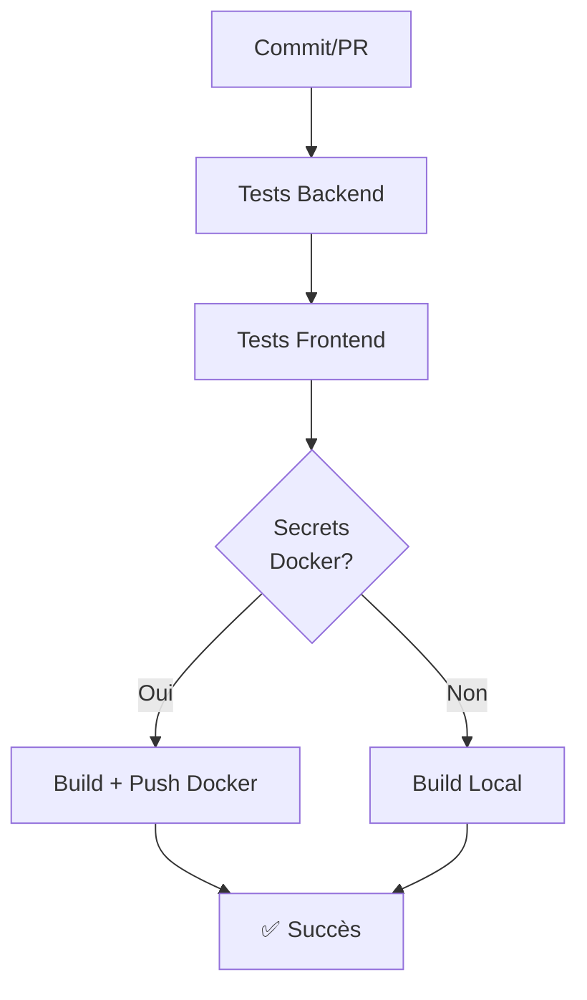

# Configuration des Secrets GitHub pour le CI/CD

## 📋 Vue d'ensemble

Le workflow CI/CD inclut la construction et le push d'images Docker vers Docker Hub. Ces étapes nécessitent des secrets GitHub configurés.

## 🔐 Secrets requis

### 1. `DOCKER_USERNAME`
- **Description** : Votre nom d'utilisateur Docker Hub
- **Exemple** : `mon_utilisateur`

### 2. `DOCKER_PASSWORD`
- **Description** : Votre token d'accès Docker Hub (ou mot de passe)
- **Recommandation** : Utilisez un **Personal Access Token** au lieu du mot de passe

## 📝 Étapes de configuration

### Générer un Personal Access Token Docker Hub

1. Allez sur [Docker Hub](https://hub.docker.com/)
2. Connectez-vous à votre compte
3. Allez à **Account Settings** → **Security** → **Personal access tokens**
4. Cliquez sur **Generate new token**
5. Donnez-lui un nom (ex: `github-ci`)
6. Sélectionnez les permissions :
   - ✅ `Read & Write` (pour push/pull des images)
   - ✅ `Read` (pour les informations publiques)
7. Cliquez sur **Generate** et copiez le token

### Ajouter les secrets à GitHub

1. Allez sur votre dépôt GitHub
2. Cliquez sur **Settings** → **Secrets and variables** → **Actions**
3. Cliquez sur **New repository secret**
4. Créez deux secrets :

   **Secret 1 :**
   - Name: `DOCKER_USERNAME`
   - Secret: `votre_nom_utilisateur_docker`
   - Cliquez sur **Add secret**

   **Secret 2 :**
   - Name: `DOCKER_PASSWORD`
   - Secret: `votre_personal_access_token_docker`
   - Cliquez sur **Add secret**

## ✅ Vérification

Après configuration :

1. Le workflow CI/CD continuera même sans les secrets (les images se construiront localement)
2. Avec les secrets configurés, les images seront automatiquement pushées vers Docker Hub
3. Consultez les logs du workflow sur l'onglet **Actions** pour voir le statut

## 🚀 Workflow actuel

Le workflow fait maintenant :

## 🔒 Bonnes pratiques

- ✅ Utilisez des **Personal Access Tokens** au lieu des mots de passe
- ✅ Limitez les permissions du token (Read & Write uniquement)
- ✅ Régulièrement expirez et renouvelez les tokens
- ✅ Ne commitez jamais les credentials dans le code
- ✅ Utilisez les GitHub Secrets pour tout ce qui est sensible

## 📌 Dépannage

### Les images ne se pusent pas vers Docker Hub
- Vérifiez que `DOCKER_USERNAME` et `DOCKER_PASSWORD` sont configurés
- Vérifiez que le token Docker n'a pas expiré
- Vérifiez les logs GitHub Actions pour plus de détails

### Erreur "Username and password required"
- Cela signifie que les secrets ne sont pas configurés
- Suivez les étapes ci-dessus pour les configurer
- Le workflow continuera à fonctionner sans les secrets (sans push Docker)

## 📚 Ressources supplémentaires

- [Docker Hub Personal Access Tokens](https://docs.docker.com/security/for-developers/access-tokens/)
- [GitHub Actions Secrets](https://docs.github.com/en/actions/security-guides/encrypted-secrets)
- [docker/build-push-action](https://github.com/docker/build-push-action)

